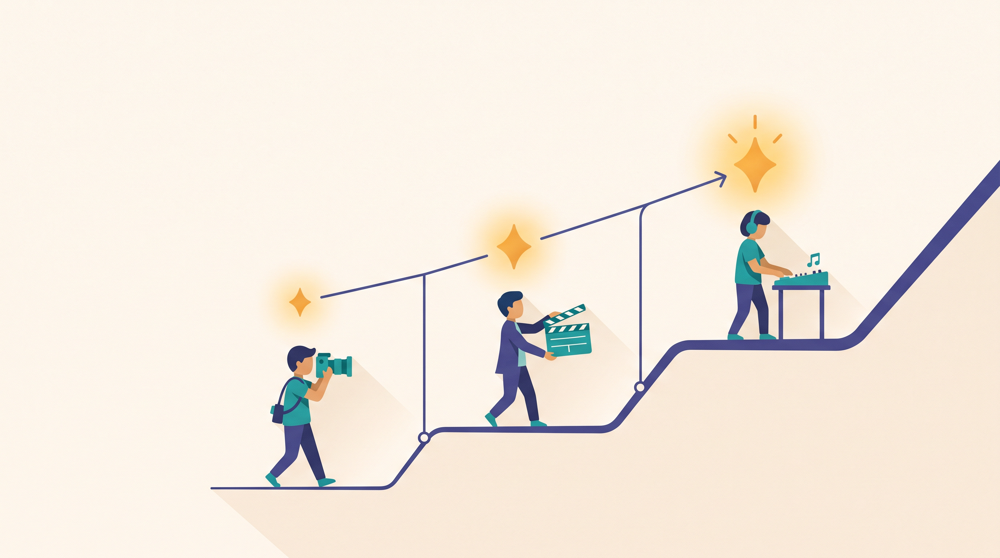
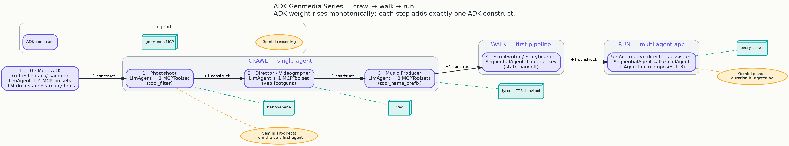

# Your own AI creative studio: from a one-line brief to a full set of on-brand assets

Picture the brief on your desk this morning: *a lone red umbrella on a rain-slicked Tokyo street at
night.* By end of day you need a hero image, a short film that moves, and a scored voiceover to go
with them — all on-brand, all consistent, all yours to direct.

That used to mean three tools, three vendors, and a week of back-and-forth. This series is about
collapsing it into a conversation. You'll build a small set of **AI creative collaborators** — a
photographer, a film director, a music producer, and eventually a whole creative team — that take a
plain-language brief and return finished, on-brand assets you stay in creative control of the whole
way.

> **The promise:** describe what you want the way you'd brief a colleague. Get back a real,
> verifiable asset — not a demo, not a maybe — with the taste and consistency your brand needs.

## What you're really building

Three technologies do the heavy lifting, and the whole point of this series is that you never have to
think about them as three things. You think about the *creative outcome*; they make it both
**approachable and genuinely powerful**:

- **Gemini** is your creative partner. Hand it a terse idea and it reasons like an art director —
  composition, lighting, lens, mood, pacing — before a single asset is generated.
- **The genmedia tools** are your studio equipment: image, video, music, voice, and the editing
  bench that stitches them together. Best-in-class generation, one consistent way to call it.
- **The Agent Development Kit (ADK)** is the studio itself — the thin, reassuring layer that turns
  "a model and some tools" into a collaborator that plans, calls the right equipment, and checks its
  own work before handing it to you.

You'll see the code. It's deliberately small — often just a dozen lines to stand up a working
agent — and it stays a supporting act. The star is always the asset that comes out the other end.

## The path: crawl, walk, run

You work through it in order. Each step is a self-contained, runnable project that delivers one new
creative capability — and each one bakes in the hard-won know-how so your results are predictable,
not a gamble.

| # | Step | The creative job it does | Status |
|---|------|--------------------------|--------|
| 0 | **Meet your studio** — the refreshed [`sample-agents/adk`](https://github.com/GoogleCloudPlatform/vertex-ai-creative-studio/tree/main/experiments/mcp-genmedia/sample-agents/adk) | one collaborator that can reach for many creative tools | ✅ shipped (#1811) |
| 1 | **The Photoshoot** — [your first agent](crawl-01-photoshoot.md) | a one-line idea → a richly art-directed, on-brand image | ✅ shipped (#1812) |
| 2 | **The Director** — [now it moves](crawl-02-director.md) | a scene → a short cinematic clip, with sound, in the right format | ✅ shipped (#1814) |
| 3 | **The Music Producer** — [give it a soundtrack](crawl-03-music-producer.md) | a brief → an original music bed + voiceover, mixed into one track | ✅ shipped (#1815) |
| 4 | **The Scriptwriter / Storyboarder** — [your first pipeline](walk-01-scriptwriter-storyboarder.md) | an idea → a script → a storyboard, handed cleanly down the line | ✅ shipped (#1816) |
| 5 | **The creative director's assistant** — [the whole team](run-01-ad-creative-director.md) | a campaign brief → one finished, on-brand ad, assembled by every collaborator | ✅ shipped (#1821) |

> Everything you read here ships only after it's been proven on a **real, credentialed run** — the
> asset actually generated, the file actually there. The whole crawl→walk→run arc is now shipped,
> from a single collaborator to the full creative team.

## Why these collaborators can be trusted

Two things make this different from "type a prompt, hope for the best."

**Your creative intent leads — every time.** None of these agents is a pass-through that forwards
your words and shrugs. Gemini's reasoning is the product: it turns *"a red umbrella in Tokyo"* into a
composed, lit, art-directed brief before it generates, so you get a considered result, not a literal
one. You start accessible and stay in control — "easy to start" never means "shallow."

**An asset that only *seems* done isn't done.** The single most important habit in this series is
**verification**. A tool reporting "success" doesn't mean the file is really there — sometimes the
result is quietly dropped, sometimes you get a link that points to nothing. So every collaborator
here **confirms the finished asset exists** and tells you exactly where it is (a saved file, a cloud
URL you can open). That's the difference between a studio you can put on a deadline and a party
trick.

## What you'll need (once, up front)

The setup is the same small checklist for every step, so do it once:

- **Python and [`uv`](https://docs.astral.sh/uv/)** — each project is `uv sync`, then `adk web` to
  open the studio in your browser. (Python ≥ 3.13.)
- **The genmedia toolkit (≥ v3.18.1) installed on your machine** — the image, video, music, voice,
  and editing tools the agents reach for. One `install.sh` from the suite.
- **A Google Cloud project with Vertex AI turned on**, and a one-time sign-in
  (`gcloud auth application-default login`).
- **A few settings** (each step ships an `.env.example` so you just copy and fill in):
  `GOOGLE_CLOUD_PROJECT`, `GOOGLE_CLOUD_LOCATION="global"`, `GOOGLE_GENAI_USE_VERTEXAI="True"`, and
  `GENMEDIA_BUCKET` for cloud output.
- **`ffmpeg`** once you reach the music/video-mixing step (not needed for steps 1–2).

One note on the model: the samples default to `gemini-3.8-flash`, served in the `global` region
(that's why the location setting is `"global"`). It's a single line in each project — point it at a
model you have access to and you're off.

## Start here

Your first collaborator is the Photoshoot: give it a sentence, get back an art-directed image you'd
be happy to put in front of a brand team.

**→ [The Photoshoot: your first creative collaborator](crawl-01-photoshoot.md)**

---

Part of the **ADK Genmedia Series**. Source of truth is the merged code on
`GoogleCloudPlatform/vertex-ai-creative-studio@main`; every capability, setting, and behavior
described here is verified against the shipped agents and a real credentialed run, never a design
doc. Visual identity: `blog/graphic-theme.md`.
