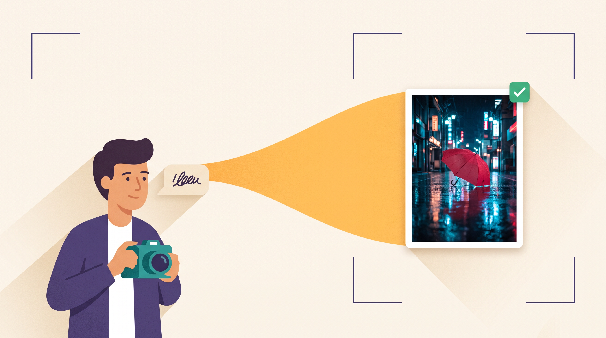
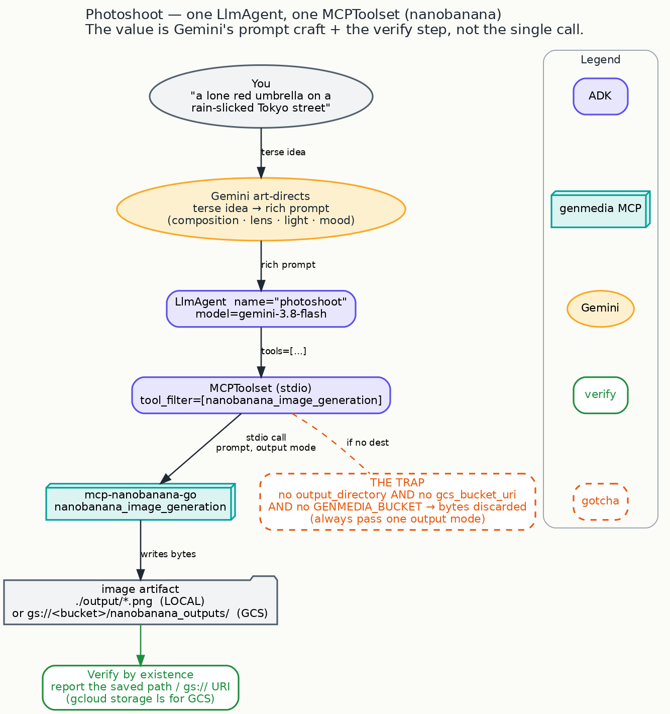

# The Photoshoot: turn one sentence into an art-directed, on-brand image



Give it a sentence — *"a lone red umbrella on a rain-slicked Tokyo street at night"* — and get back
a genuinely art-directed image: composed, lit, styled, saved, and ready to hand to a brand team. Not
a literal snapshot of your words, but the shot a thoughtful photographer would have taken from that
brief.

That's the Photoshoot, your first creative collaborator in this series. It's the smallest agent
you'll build — and it already does the two things that make an AI collaborator worth having: it
**thinks like an art director before it generates**, and it **proves the result is really there**
before it tells you it's done.

> The magic here isn't "it made an image." It's that a one-line idea comes back as a considered,
> repeatable creative choice — and you stay the director.

## What makes this one worth it

A single tool, a single call — and yet the result feels art-directed rather than automated. The
reason is where the work happens: **Gemini treats your sentence as a brief, not a caption.** Before
anything is generated, it reasons about subject, composition, camera angle, lens, lighting, and
mood — the same decisions a photographer makes on set. The generation is almost the easy part; the
taste is the point.

*Powerful, made approachable:* the studio plumbing (ADK) and the image tool (genmedia) stay quietly
in the background so the creative reasoning (Gemini) can be the star.

## Look how little it takes

Here's the whole collaborator. You don't need to read it like code — just notice how small it is:
one line to give the agent its camera (the image tool), a few lines to give it its creative
instincts.

```python
MODEL = "gemini-3.8-flash"

# give the agent its "camera": the image-generation tool
nanobanana = MCPToolset(
    connection_params=StdioConnectionParams(
        server_params=StdioServerParameters(command="mcp-nanobanana-go", env=server_env),
        timeout=120,
    ),
    tool_filter=["nanobanana_image_generation"],
)

# the collaborator itself: a model + that one tool + its creative brief
root_agent = LlmAgent(
    model=MODEL,
    name="photoshoot",
    instruction=INSTRUCTION,   # <- the art-direction lives here
    tools=[nanobanana],
)
```

That's genuinely it. *(For the record, quoted from the shipped
[`photoshoot/photoshoot/agent.py`](https://github.com/GoogleCloudPlatform/vertex-ai-creative-studio/blob/main/experiments/mcp-genmedia/sample-agents/adk-genmedia-series/photoshoot/photoshoot/agent.py).)*
The single most important line isn't in the wiring at all — it's `INSTRUCTION`, the creative brief
that turns a generic image model into *your* photographer.



## Where the taste lives

The instruction is what makes this a collaborator instead of a vending machine. It tells Gemini,
explicitly, to **never pass your raw words straight through** — to art-direct first, reasoning about:

> *Subject & action … Composition & camera: shot type and angle … lens language … Light & mood:
> named lighting … Style & medium …*

A terse idea goes in; a photographer's brief comes out. That single move — a real creative decision
made on your behalf, which you can always override — is the whole reason the output feels directed.

## Try it

```bash
cp .env.example .env      # copy the template, fill in your settings
uv sync                   # set up the project
source .venv/bin/activate
adk web                   # opens the studio in your browser — pick "photoshoot"
```

Then brief it, in plain language:

> Photograph a lone red umbrella on a rain-slicked Tokyo street at night, save it locally.

It art-directs the shot, generates the image into your `./output/` folder, and reports the exact
path. *(This is the very prompt used to prove the agent on a real credentialed run before it
shipped — it produced a real local file, and in cloud mode a real object in your storage bucket.)*

## Why you can trust the result

Here's the habit that makes this collaborator dependable — and it's worth internalizing on day one,
because every later step relies on it.

**A tool saying "done" is not the same as a file you can open.** So the Photoshoot is built to be
honest about its output in two ways:

1. **It always saves somewhere on purpose.** The image tool only keeps the picture if you tell it
   where to put it — a local folder or a cloud bucket. Leave that out and the result is quietly
   discarded. The agent never leaves that to chance; it always chooses a destination.
2. **It tells you where the asset actually is.** You get back a real saved path or a cloud URL you
   can open — never a vague "success." For cloud output you can confirm it yourself with a one-line
   `gcloud storage ls`.

There's one honest nuance worth stating plainly, because it comes up in the very next step. The
Photoshoot only has its camera — no separate "go check the folder" tool — so it trusts the path the
image tool reports *after* the file is written. That's fair here. But in the next step, the video
tool can hand back a link that *isn't* proof the file exists — and there, "it returned a link" will
never be good enough. Hold that thought.

## One thing you'll be glad you know later

Different pieces of studio equipment describe the same idea with slightly different words — one tool
says "bucket," another says something else for the same "save it to the cloud" setting. With a
single tool you'll never notice. The moment you wire up several (that's the Music Producer, step 3),
those differences matter — and there's a simple crosswalk,
[`NAMING.md`](https://github.com/GoogleCloudPlatform/vertex-ai-creative-studio/blob/main/experiments/mcp-genmedia/sample-agents/adk-genmedia-series/NAMING.md),
that keeps them straight.

## See also

- **The `genmedia-image-artist` skill** — the same image craft (narrative prompts, cinematic
  control, multimodal refinement) packaged as a reusable creative recipe rather than a runnable
  agent. Read it for deeper prompting technique; the Photoshoot is the same idea you can actually
  run. This series *complements* those skills — it never forks them.

## Next

Your image is in the can. Now make it move: **[The Director: a scene becomes a short film, with
sound](crawl-02-director.md)** — the same tiny setup, but video, where the agent's judgment quietly
saves you from the settings that would otherwise trip you up.

---

<sub>Grounded on merged PR **#1812**. Code excerpt quoted from `photoshoot/photoshoot/agent.py` on
`main` (lightly trimmed for reading; the source-guard lines are in the file). Diagram:
`blog/diagrams/photoshoot.dot`. Visual identity: `blog/graphic-theme.md`.</sub>
