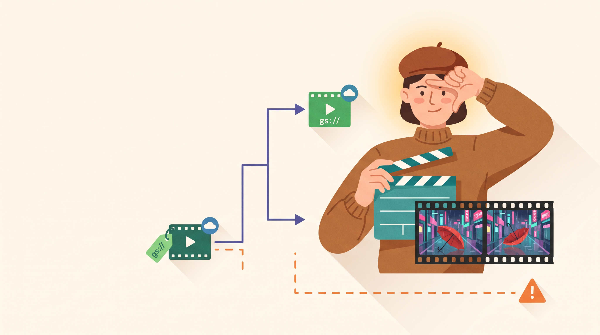
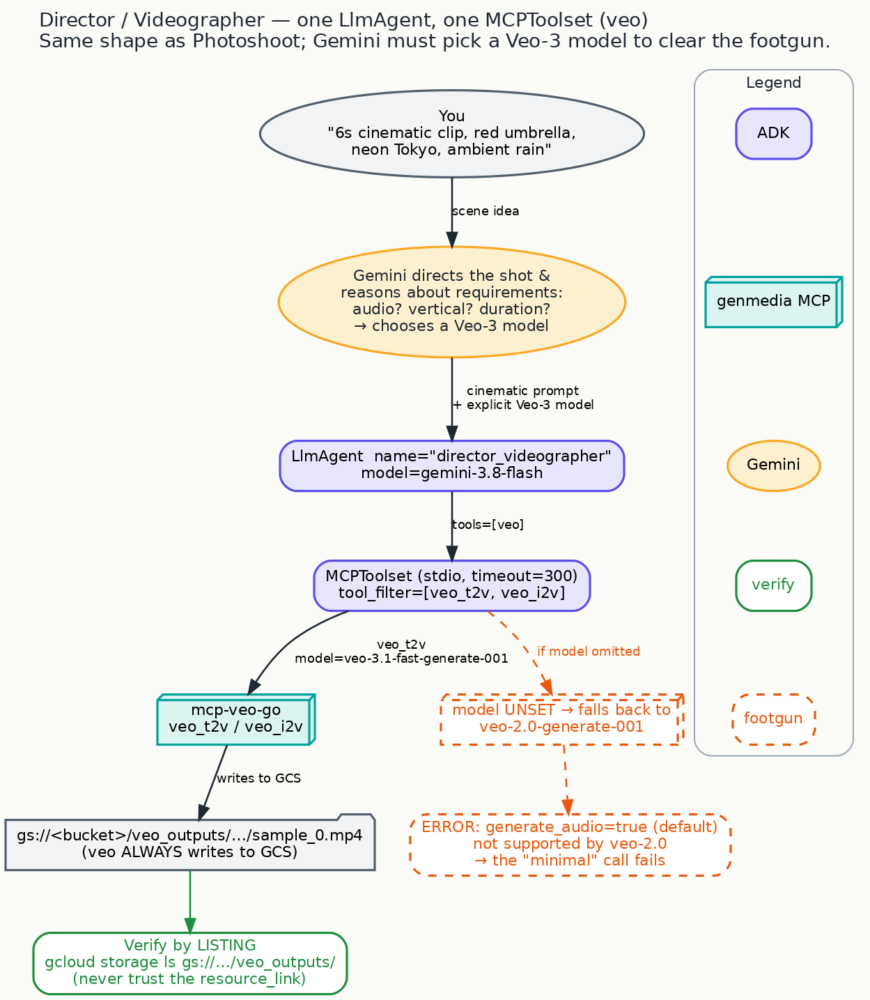

# The Director: a scene becomes a short film — with sound, in the right format



Your image was still. Now make it move. Describe a scene — *a red umbrella tumbling down a
rain-slicked Tokyo street, neon reflections, the sound of rain* — and the Director hands you back a
short cinematic clip: composed like a shot, generated with sound, delivered in the aspect ratio your
channel actually needs, and saved somewhere you can open it.

It's the same tiny collaborator you built for the Photoshoot, pointed at video instead of stills.
Everything new is in the *judgment* — because video is where a naive "just make me a clip" quietly
goes wrong, and where a good creative collaborator earns its keep by getting the details right for
you.

> A great director doesn't just call "action." They pick the format, make sure the sound is
> rolling, and check the footage is really in the can. This agent does all three — so you don't have
> to.

## What makes this one worth it

The setup barely changes from the Photoshoot. What changes is how much the agent has to *think*
before it shoots: Does this scene need sound? Is it vertical for social, or wide for the site? How
long should it run? Video generation has real rules about what combinations are allowed, and Gemini
reasons through them so your clip comes out right the first time — with audio, in your format —
instead of erroring out or arriving silent.

*Powerful, made approachable:* the same small studio setup, now carrying a much smarter creative
decision.

## Look how little it takes (again)

If you've seen the Photoshoot, this will feel familiar — that's the point. Swap the camera for a
film crew and you have a director:

```python
MODEL = "gemini-3.8-flash"

# give the agent its film crew: the video-generation tool
veo = MCPToolset(
    connection_params=StdioConnectionParams(
        server_params=StdioServerParameters(command="mcp-veo-go", env=server_env),
        timeout=300,                      # video takes longer than a photo — give it room
    ),
    tool_filter=["veo_t2v", "veo_i2v"],   # text-to-video and image-to-video
)

root_agent = LlmAgent(
    model=MODEL,
    name="director_videographer",
    instruction=INSTRUCTION,
    tools=[veo],
)
```

*(Quoted from the shipped
[`director_videographer/agent.py`](https://github.com/GoogleCloudPlatform/vertex-ai-creative-studio/blob/main/experiments/mcp-genmedia/sample-agents/adk-genmedia-series/director-videographer/director_videographer/agent.py).)*
Once you know the shape, adding a whole new medium is mostly a matter of pointing the agent at
different equipment and teaching it that equipment's rules. That's the freedom this pattern buys you.



## Try it

```bash
cp .env.example .env
uv sync
source .venv/bin/activate
adk web                   # pick "director_videographer"
```

Brief it like a director:

> Direct a 6-second cinematic clip: a lone red umbrella tumbling down a rain-slicked Tokyo street at
> night, neon reflections, with ambient rain sound. Save it to my cloud bucket.

It composes the shot, makes sure the clip has sound, generates it, and reports the cloud URL. You can
confirm the footage landed with a single line:

```bash
gcloud storage ls gs://<your-bucket>/veo_outputs/
```

Want a vertical clip for social from an existing still? Hand it a starting frame that already lives
in your bucket:

> Animate gs://my-bucket/stills/umbrella.png — slow push-in, gentle rain. 9:16.

That `9:16` isn't a throwaway detail — asking for vertical automatically steers the agent to the
model that *can* deliver vertical. Which brings us to why this collaborator is so quietly valuable.

## Why your clip "just works": the judgment you don't have to have

Everything below is **verified against the actual video engine** and reproduced on the credentialed
run that shipped this agent. You don't need to memorize any of it — that's the whole point. The
Director carries this knowledge *for* you, so the failure modes below simply never reach you.

**It always rolls sound.** Video with audio requires a current-generation ("Veo-3") model. Ask for
a clip *without* being specific and the engine quietly falls back to an older model that **can't do
audio** — and the request fails outright *(older model has `SupportsGenerateAudio: false`;
`mcp-common/models.go:257-264`, error at `utils.go:132-134`)*. The agent never lets that happen: it
always chooses a current model, so "with the sound of rain" actually delivers rain. This is Gemini's
judgment turned into a dependable result.

**It matches the format to the channel.** The engine only allows certain shapes and lengths per
model *(aspect ratio `utils.go:106-124`; duration `utils.go:81-104`)*:

- **Vertical (9:16) or wide (16:9)** are both available — but vertical needs the newer model, which
  is exactly why asking for `9:16` steers the agent there.
- **Clips run 4, 6, or 8 seconds.** Ask for something in between and the agent keeps you to a length
  that will actually render.

**It puts the footage where you can find it.** Video always saves to cloud storage; the agent sends
it to your bucket (falling back to your default `GENMEDIA_BUCKET` under `.../veo_outputs/`), and can
keep a local copy too.

**It confirms the footage is really there — it doesn't take a link's word for it.** This is the
strict version of the trust habit from the Photoshoot. The video tool hands back a preview *link*
per clip *(`video_logic.go:475-506`)* — but a link is **not proof the file was saved**, and many
apps can't even open it. What's trustworthy is the tool's own *"Videos saved to GCS: gs://…"*
confirmation *(`video_logic.go:426-427`)*, emitted only after the files are actually written. The
agent relays that real destination and tells you to list it. **Verify by listing** — never trust a
link.

## A small thing that becomes a big thing soon

You may have noticed the video tool describes its "save to the cloud" setting with a different word
than the image tool did, and counts clips differently than the image tool counts images. Harmless
now — but the moment one agent drives *three* different tools at once, those little differences add
up. That's the [naming
crosswalk](https://github.com/GoogleCloudPlatform/vertex-ai-creative-studio/blob/main/experiments/mcp-genmedia/sample-agents/adk-genmedia-series/NAMING.md),
and it takes center stage in the next step.

## See also

- **The `genmedia-video-editor` skill** — the same Veo craft (the cinematic prompt formula,
  soundstage direction, first/last-frame and reference-image workflows, plus FFmpeg compositing) as
  a reusable creative recipe. The Director is the same idea you can run as an agent.

## Next

You have a picture and a moving shot. Time to score them: **[The Music Producer: an original bed,
a voiceover, mixed into one track](crawl-03-music-producer.md)** — your first collaborator that runs
three pieces of studio gear at once.

---

<sub>Grounded on merged PR **#1814**. Code excerpt quoted from `director_videographer/agent.py` on
`main` (lightly trimmed for reading). The engine behaviors above are source-verified against the veo
Go server and shared model registry and confirmed by the agent's credentialed run; file:line
citations are quoted from the merged agent's README. Diagram: `blog/diagrams/director.dot`. Visual
identity: `blog/graphic-theme.md`.</sub>
