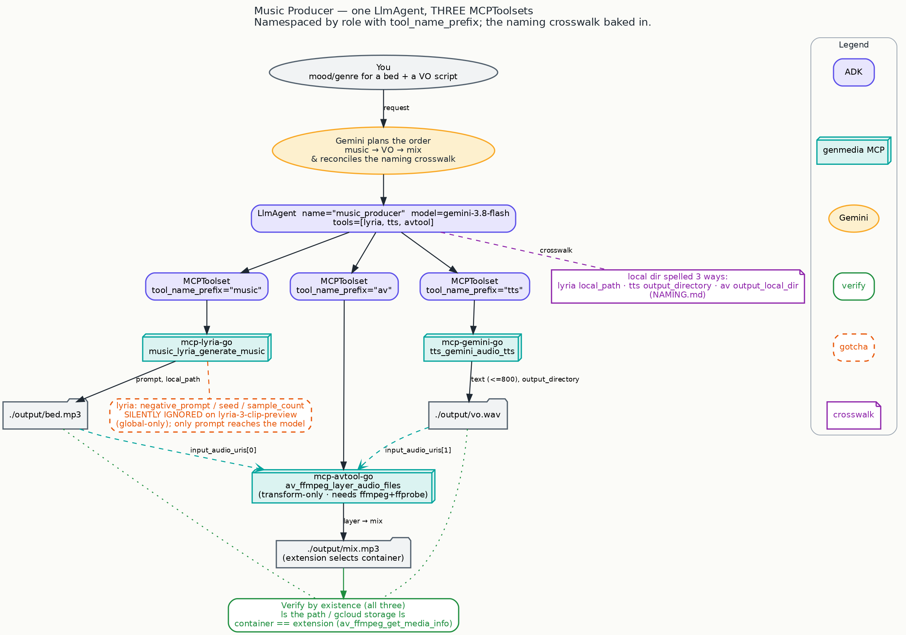

# The Music Producer: a brief becomes an original score, a voiceover, and a finished mix


Now for sound. Describe the spot — *a warm lo-fi bed under a short line of voiceover* — and the Music
Producer composes an original music track, records the voiceover, and **mixes them into a single
finished file** you can drop straight onto a video. One brief in; a produced audio asset out.

This is the first collaborator that runs a whole rack of gear at once: a composer, a voice booth, and
a mixing desk — three separate pieces of studio equipment, working in sequence, coordinated by one
agent. And that's the real lesson here. Going from one tool to three is the moment a single
collaborator starts to feel like a *studio*.

> A producer's job isn't to play every instrument. It's to bring the right people in, in the right
> order, and hand you one finished master. That's exactly what this agent does.

## What makes this one worth it

The creative payoff is a mixed, ready-to-use track from a plain-language brief. Behind it, the agent
is doing the coordination a human producer would: **compose the music, record the voice, then mix** —
each step feeding the next, each output a real file the next step can pick up.

*Powerful, made approachable:* three best-in-class tools, one conversation. The complexity of
juggling them is handled for you.

## Look how little it takes to run a whole rack

Each piece of gear plugs in the same way you've already seen — a composer, a voice, a mixing desk —
and the agent gets all three:

```python
lyria  = MCPToolset(..., tool_filter=["lyria_generate_music"], tool_name_prefix="music")  # the composer
tts    = MCPToolset(..., tool_filter=["gemini_audio_tts"],     tool_name_prefix="tts")    # the voice booth
avtool = MCPToolset(..., tool_filter=[...],                    tool_name_prefix="av")     # the mixing desk

root_agent = LlmAgent(
    model=MODEL,
    name="music_producer",
    instruction=INSTRUCTION,
    tools=[lyria, tts, avtool],   # one producer, three pieces of gear
)
```

*(Condensed from the shipped
[`music-producer/music_producer/agent.py`](https://github.com/GoogleCloudPlatform/vertex-ai-creative-studio/blob/main/experiments/mcp-genmedia/sample-agents/adk-genmedia-series/music-producer/music_producer/agent.py)
— each toolset is the same simple shape as the Photoshoot's, just three of them.)* The only genuinely
new idea is that little `tool_name_prefix` — a name tag on each piece of gear.



## The one new idea: give every piece of gear a name tag

When three tools share one studio, their controls can start to look alike, and the agent can lose
track of which knob belongs to which machine. The fix is simple and human: put a **name tag** on each
one — `music`, `tts`, `av` — so every control reads unmistakably as *the composer's*, *the voice
booth's*, or *the mixing desk's*. Collisions become impossible, and you (and the agent) can always
tell what's controlling what.

That's the whole concept. It's plumbing — but it's the plumbing that lets one agent grow from a solo
act into a coordinated team, which is the direction the rest of this series heads.

## Different gear, different dials — and why that's handled for you

Here's the honest reality of assembling a studio from best-in-class parts: they were built by
different teams, so they don't all label their dials the same way. One calls the "save it locally"
setting one thing; another calls it something else. One takes your *words* in a field called `text`;
another would read the same field as a *style* note. Get a label wrong and the setting is simply
ignored — the classic "why did nothing happen?" moment.

You don't have to hold any of this in your head. The agent knows the exact dials for its own three
tools, and there's a plain-English crosswalk —
[`NAMING.md`](https://github.com/GoogleCloudPlatform/vertex-ai-creative-studio/blob/main/experiments/mcp-genmedia/sample-agents/adk-genmedia-series/NAMING.md) —
if you ever want to look under the hood. This is the payoff of the "small thing" the Photoshoot and
Director flagged: with three tools in one room, the crosswalk is what keeps them in tune.

## Try it

```bash
cp .env.example .env
uv sync
source .venv/bin/activate
adk web                   # pick "music_producer"
```

Brief your producer:

> Produce a warm lo-fi hip-hop bed and a short voiceover saying "Welcome to the show." Mix them into
> a single MP3.

It composes the bed, records the voiceover, mixes them, and reports all three finished files (and how
to open them). *(Its credentialed run produced exactly that: an original music bed, a spoken
voiceover, and a mixed MP3 — the mix confirmed as a real, correctly-formatted file.)*

## Why the finished mix is dependable

Three pieces of gear, three things a seasoned producer just *knows* — all built into the agent so
your session goes smoothly:

1. **The composer keeps it simple, on purpose.** The music tool's default model listens to your
   creative *prompt* and returns one take; a few advanced dials (like seeds or multiple variations)
   aren't honored by that model, so the agent doesn't pretend they are — it sticks to what actually
   shapes the music. *(This model also runs in the `global` region — one more reason for the
   `"global"` setting.)*
2. **The mixing desk only mixes — it never generates.** It needs real audio files to work with and
   the standard `ffmpeg` toolkit on your machine, which is why the agent always composes and records
   *first*, then mixes. And the file extension you ask for picks the format: `mix.mp3` gives you an
   MP3, `mix.wav` gives you a WAV.
3. **The voice booth separates the words from the delivery.** You give it the *words to speak* (a
   short line — up to roughly 800 characters) separately from the *style* of the read. It's a small
   distinction that makes the voiceover come out the way you meant.

And the constant you've now seen three times: **every output is a real, confirmed file** — the agent
reports the actual saved path, never a vague "done." That's the habit that lets you put this studio
on a real deadline.

## See also

- **The `genmedia-audio-engineer` skill** — the same music/voice/mix craft as a reusable creative
  recipe.
- **The `genmedia-producer` skill** — the broader producer workflow this agent's mixing step echoes.
  The Music Producer is the runnable, multi-tool version of the same ideas.

## Next

That's the **crawl tier complete** — you can now brief a collaborator for a still image, a short film
with sound, and a fully mixed audio track. Next, your collaborators start working *as a team*:
**Scriptwriter / Storyboarder** takes an idea, writes the script, and hands it cleanly to the
storyboard — your first real creative pipeline. *(Publishing once it ships and its credentialed run
passes.)*

---

<sub>Grounded on merged PR **#1815** (commit 8979c9f). Code condensed from
`music-producer/music_producer/agent.py` on `main` for reading; the full wiring (stdio setup,
timeouts, the exact tool list) is in the file. Tool behaviors and the naming crosswalk are
source-verified against the genmedia Go sources and confirmed by the agent's credentialed run.
Diagram: `blog/diagrams/music-producer.dot`. Visual identity: `blog/graphic-theme.md`.</sub>
