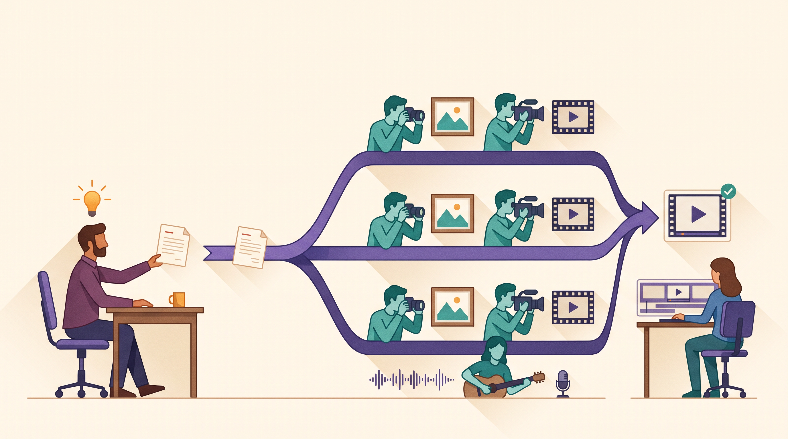
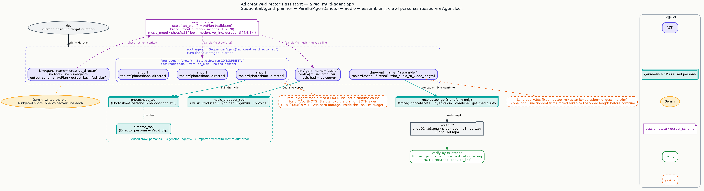

# The Creative Director's Assistant: a brand brief becomes a finished, on-brand ad — automatically



Here is the brief you'd normally hand to a whole team:

> *Make a 20-second ad for **Aurora**, a canned cold-brew coffee. Bright and optimistic,
> morning-city energy, and end on a clean shot of the can with the tagline "Mornings, brightened."*

And here is what comes back: **one finished short video ad** — `final_ad.mp4` — with a planned set
of hero shots, a still and a motion clip for each, a music bed, a voiceover, and everything mixed
and cut to length. Not a mood board. Not a folder of clips for you to assemble. A single assembled
ad, within the duration you asked for, every piece verified to actually exist.

> This is the payoff of the whole series. Everything you built in the earlier steps — the
> photographer, the videographer, the music producer, the way collaborators hand work down the line
> — now works together as **one studio**, run by a creative director you brief in a sentence.

## The leap: from a team of two to a whole crew

The last collaborator was a two-person handoff. This one is the full production, and it introduces
the one idea that makes a real multi-agent app: **collaborators can run in parallel, and finished
collaborators can be reused as tools.**

The director runs your brief through four stages, in order:

1. **Plan.** A creative director reads the brief and writes a tight, duration-budgeted shot plan —
   the brand, the total length, the music mood, and a handful of hero shots, each with its *look*,
   its *motion*, and its *one voiceover line*.
2. **Shoot — all at once.** Each planned shot goes to its own shot team, and the teams work **in
   parallel**. Every team calls the **Photoshoot** for a still, then the **Director / Videographer**
   to animate that still into a clip — the exact personas you already built.
3. **Score.** The **Music Producer** — again, the one you already built — lays down a music bed in
   the planned mood and records the voiceover.
4. **Assemble.** An editor stitches the clips in order, mixes the music under the voice, trims the
   audio to the picture, and lays it over the video — then confirms the finished file is really there.

The headline for a builder: **the director doesn't re-learn photography, film, or music.** It hires
the specialists you already made and simply *directs* them. That's the difference between a demo and
a studio.

## Reuse, don't rebuild — the whole point of the capstone

The most important line in this agent isn't new equipment; it's the fact that there's almost no new
equipment at all. The three crawl-tier collaborators are picked up **as-is** and handed to the
director as callable teammates:

```python
# The specialists you already shipped, reused verbatim — not rewritten.
photoshoot_tool      = AgentTool(agent=photoshoot_agent)     # stills  (from step 2)
director_tool        = AgentTool(agent=director_agent)       # clips   (from step 3)
music_producer_tool  = AgentTool(agent=music_producer_agent) # music + voice (from step 4)
```

`AgentTool` wraps a finished agent so another agent can call it like a tool. When a shot team calls
the Photoshoot, it runs the *real* Photoshoot — its own instructions, its own image tool, its own
"verify the file exists" habit — in its own private workspace, so several shot teams can call the
same specialists at the same time without stepping on each other.

*Powerful, made approachable:* every craft lesson from the earlier posts — the explicit Veo-3 model
that keeps video sound working, the music producer's naming crosswalk, verify-by-existence — is
still in force here, because these are literally the same collaborators. You taught them once; the
director just conducts them.

*(One practical note this build is honest about: because the director reuses its siblings by
importing them from the folders next to it, those example folders need to be present in a normal
checkout. It's one example reusing the examples beside it — and if one is missing, it says so
clearly at startup instead of failing mysteriously.)*

## How it works

Four stages, wired in order, with the shoot stage fanning out to run in parallel:

```python
root_agent = SequentialAgent(name="ad_creative_director_ad", sub_agents=[
    planner,     # writes a schema-checked plan onto the shared desk
    shots,       # ParallelAgent: three shot teams run at once
    audio,       # reuses the Music Producer for bed + voiceover
    assembler,   # cuts the clips, mixes + trims the audio, verifies the final .mp4
])
```



Two ideas in that picture are worth a closer look, because they're what make the output *reliable*
rather than merely impressive.

### A plan that's data, not a paragraph

The creative director's only job is to think — it has **no tools at all**. It reads your brief and
returns a **structured plan** instead of prose: a filled-in form with a slot for the brand, the
total duration, the music mood, and each shot's look, motion, and voiceover line. Because the plan
has a guaranteed shape, every downstream stage can rely on it — the shot teams know exactly where to
find "shot 2's look," the musician knows exactly where to find the mood.

The form even enforces the rules that keep an ad shippable: the total duration must land inside the
**15-second-to-2-minute** budget, and every shot's length must be one of the durations the video
model actually supports. A plan that breaks those rules is rejected the moment it's written — so a
bad plan can never quietly reach the expensive generation step. *(Under the hood this is ADK's
`output_schema`: the planner's reply is validated against a Pydantic model, `AdPlan`, and filed in
shared state as data. If you like to look: `llm_agent.py:404/1044-1045`.)*

### Why exactly three shots

The shoot stage runs a **fixed set of three shot teams**. That number isn't arbitrary, and it isn't
a limitation you'll trip over — it's the honest math of a short ad. Each shot becomes a video clip,
and the video model produces clips of 4, 6, or 8 seconds. Three shots therefore give you 12–24
seconds of distinct hero footage — exactly the shape of a bumper or short-form ad, comfortably
inside the budget. If you ask for something longer, the director plans to that ceiling and *tells*
you, rather than inventing filler.

*(The technical reason it's a fixed number: ADK's parallel stage runs a set list of teammates
decided when the app is built, not a count invented at runtime. So the build makes exactly three
slots; if a plan has fewer shots, the extra slots simply do nothing. The plan is capped to three on
both sides — in the form's rules and in the director's instructions — so nothing is ever silently
dropped.)*

### One small, honest seam: keeping the music from overrunning the picture

There's exactly one spot where the editor reaches past the managed tools for a tiny local helper,
and it's a good illustration of real production. The reused Music Producer's bed is a fixed ~30-second
clip, and the mixing tool always mixes to the *longer* of its inputs. Mix a 30-second bed onto a
20-second ad and you'd get a 30-second file with ten seconds of music over a frozen tail. So the
editor trims the mixed audio down to the exact length of the cut picture before the final combine —
a small, clearly labeled step that keeps both the music and the voice, and never touches the video.

*Powerful, made approachable:* real pipelines are full of seams like this, where a managed tool
doesn't expose the one setting you need. The honest move — the one this build models — is a small,
well-labeled local step, not pretending the gap isn't there.

## Try it

```bash
cp .env.example .env      # copy the template, fill in your settings
uv sync
source .venv/bin/activate
adk web                   # pick "ad_creative_director_ad"
```

This is the one agent that exercises **every** genmedia server — stills, video, music, voice, and
the final assembly — so make sure the media toolkit (the genmedia MCP suite, plus `ffmpeg`) is
installed and your cloud project and storage bucket are set, exactly as in the earlier posts.

Then brief it like a creative director, and name your duration:

> Make a 20-second ad for **Aurora**, a canned cold-brew coffee. Bright and optimistic, morning-city
> energy, and end on a clean shot of the can with the tagline "Mornings, brightened." Save artifacts
> locally.

It plans a three-shot spine, generates a still then a clip for each shot in parallel, scores it with
a music bed and a voiceover, and assembles `./output/final_ad.mp4` — reporting the verified path and
the measured duration.

*(You may see a little teardown noise in the logs as the parallel shot teams finish — the kind of
"connection closed" chatter that comes from three specialists wrapping up at once. It's harmless,
it's retried, and it blocks nothing. The build calls it out so you don't mistake it for a failure.)*

## Why the ad you get back is trustworthy

The same trust habit that's run through the whole series, now applied to the finished product: the
editor confirms `final_ad.mp4` by **actually finding the file and measuring it** — reading its
media info and listing it on disk — never by trusting a "here's your link" response. It matters most
here because the video step returns exactly such a link, and a link is not proof that anything was
saved. If the final file isn't really there, you're told — you never get a green checkmark over an
ad that doesn't exist.

That's the through-line of the series in one sentence: **it only claims what it can point to.**

## See also

- **`countdown-workflow`** — a hand-written pipeline that does this same end-to-end job (script →
  first-frame stills → continuous clips → validate → compose with music) on a different surface. This
  capstone re-expresses that shape in ADK's building blocks; read the workflow for the deeper
  composition craft. (Complements the demos, never forks them.)
- **The `story-generator` skill** — its "writers' room → generate every scene" shape, and its
  self-critique "QC room," are the storytelling craft behind the planner and a natural future
  quality-check stage. Read it for the technique; this agent is a runnable ADK surface of the same
  idea.

## Next

You've reached the finale — a brand brief becomes a finished, on-brand ad, built entirely from the
collaborators you assembled one at a time. Head back to the [series overview](00-overview.md) to see
the whole arc, from a single specialist to a full creative studio. From here the natural extensions
build directly on what you just saw: an automatic quality-check pass on each shot, or a second
director "profile" that produces a different kind of cut from the same crew.

---

<sub>Grounded on merged PR **#1821** (squash-merge `a8ce2df` on `main`; content verified against the
shipped tree at `ad-creative-director/`). Code is condensed for reading; the full wiring — the
`sys.path` sibling imports, the planner base instruction, the fixed three-slot shot stage, the
assembler's avtool tool-filter and the `trim_audio_to_video_length` helper — is in
`ad_creative_director/agent.py`, `profiles.py`, and `schemas.py`. Architecture, the `output_schema`
plan (`AdPlan`), the `MAX_SHOTS = 3` cap, `AgentTool` reuse semantics, the Lyria-bed-vs-avtool trim
rationale, and verify-by-existence are source-verified against ADK 2.8.0 and the merged agent's
README. Diagram: `blog/diagrams/ad-creative-director.dot`. Visual identity: `blog/graphic-theme.md`.</sub>
