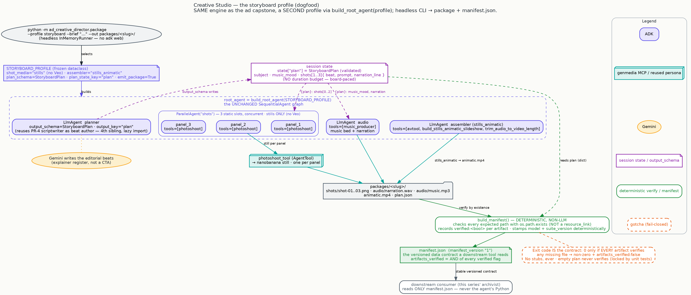

# The Creative Studio that documents itself: one brief becomes a storyboard package a machine can read


Here's a different kind of brief — not for an ad, but for a story:

> *A quiet three-panel storyboard for a lighthouse keeper at dawn; hopeful, cinematic, ends on the
> lit lamp.*

And here's what comes back: a **neatly packaged storyboard** you can hand straight to a designer, a
CMS, or an automated publishing pipeline — a folder of numbered still panels, a narration track, a
music bed, an assembled animatic video, and, most importantly, a small **`manifest.json`** — a
machine-readable index that says *exactly* what's in the package and confirms every file is really
there.

> This is the studio turning its camera on itself. The same engine that made a finished ad in the
> last chapter now runs in a second mode built to **produce content other tools can consume** — the
> "we built this to write about itself" step.

## The leap: one engine, a second job — and almost no new machinery

The remarkable part is how little changed. This isn't a new studio; it's the **exact same crew and
pipeline** from the last chapter, wearing a different hat. A single internal setting — a *profile* —
switches the whole engine from "make one polished ad" to "make an editorial storyboard package," and
the graph underneath is untouched.

- The **ad profile** (what you built last time) takes a brand brief and a duration, shoots motion
  clips, and assembles one persuasive `final_ad.mp4`. It still opens in the visual studio exactly as
  before.
- The **storyboard profile** — "Creative Studio" — takes a *subject* brief, generates one **still
  panel per beat** (no video, no ad clock — the board is paced by the story), lays a narration and a
  music bed, assembles a **stills animatic**, and emits the whole thing as a **package plus a
  manifest**.

*Powerful, made approachable:* growing a second product out of a working one didn't mean rebuilding
anything. It meant flipping a handful of clearly-named switches — what the planner writes, whether
each shot is a clip or just a still, how it's assembled, and whether to emit a package.

```python
# The same engine, two profiles. Flip a few named fields — the graph is unchanged.
AD_PROFILE        = Profile(name="ad",        shot_media="clips",  emit_package=False, …)
STORYBOARD_PROFILE = Profile(name="storyboard", shot_media="stills", emit_package=True,  …)

root_agent = build_root_agent(AD_PROFILE)   # `adk web` still opens the ad studio, unchanged
```

*(Condensed from the shipped
[`profiles.py`](https://github.com/GoogleCloudPlatform/vertex-ai-creative-studio/blob/main/experiments/mcp-genmedia/sample-agents/adk-genmedia-series/ad-creative-director/ad_creative_director/profiles.py).
The storyboard profile also reuses your Scriptwriter from chapter 5 as its beat author — a
collaborator reused inside a collaborator.)*



## Run it — as a tool, not a chat

The ad studio is something you *talk to* in a visual interface. The Creative Studio is something you
*call* — a headless command that scripts cleanly and hands back files, not a conversation:

```bash
uv run python -m ad_creative_director.package \
    --profile storyboard \
    --brief "A quiet three-panel storyboard for a lighthouse keeper at dawn; hopeful, cinematic, ends on the lit lamp." \
    --out packages/lighthouse/
```

What lands on disk is a tidy, predictable package:

```
packages/lighthouse/
├── manifest.json     # the machine-readable index (read this downstream)
├── plan.json         # the storyboard plan, for provenance
├── shots/            # shot-01.png, shot-02.png, shot-03.png — one panel per beat
├── audio/            # narration.wav, music.mp3
└── animatic.mp4      # the assembled stills animatic
```

*(This is a real shipped run: the `packages/lighthouse/` package above was produced on a credentialed
environment — three verified panels of a lighthouse keeper's dawn watch, a contemplative music bed, a
narration track, and an animatic whose audio lands in sync to within a hundredth of a second.)*

## The one new idea: an output a machine can trust

Everything before this chapter produced things for *people* to look at. This chapter produces
something for *other software* to read — and that changes what "done" has to mean.

The heart of it is `manifest.json`: a small, versioned index of the package. Here's the real one from
the lighthouse run, trimmed:

```jsonc
{
  "manifest_version": "1",
  "profile": "storyboard",
  "subject": "The dawn watch of a coastal lighthouse keeper",
  "shots": [
    { "index": 1, "beat": "Ascending the tower in the pre-dawn quiet", "image": "shots/shot-01.png", "verified": true },
    { "index": 2, "beat": "Greeting the calm ocean at the break of dawn", "image": "shots/shot-02.png", "verified": true },
    { "index": 3, "beat": "Igniting the lamp across the awakening sea",   "image": "shots/shot-03.png", "verified": true }
  ],
  "audio": { "narration": "audio/narration.wav", "music": "audio/music.mp3" },
  "assembled": "animatic.mp4",
  "artifacts_verified": true
}
```

Two design choices make this trustworthy, and both are the series' habits taken to their logical end:

**The index is written by a plain, non-AI function — not the model.** The creative work is done by
the AI collaborators; the *bookkeeping* is done by a small, deterministic piece of ordinary code. It
walks the plan, works out which files should exist, and checks each one **by actually looking for it
on disk** — never by trusting a "here's your file" response. Provenance fields like the model name
and the media-toolkit version are stamped in the same deterministic way, from the real environment,
so the manifest reflects what was actually used.

**"Verified" means the file is really there — or the whole run fails.** Every panel and track carries
its own `verified` flag, and the top-level `artifacts_verified` is true **only if every single file
exists**. If anything is missing, the command **exits with an error** and the manifest honestly
records which files weren't there. There are **no placeholders, ever** — a missing file is a hard
failure, not a stand-in. (This behavior is locked down with unit tests that deliberately delete a
panel, drop a track, or hand it an empty plan, and confirm the packager refuses to call any of them a
success.)

*Powerful, made approachable:* a downstream tool never has to open the studio's internals or trust a
chat log. It reads one small, stable, versioned file and knows — provably — what it's been handed.

## The forward-looking part: this is how the series will illustrate itself

There's a reason this tool exists in a blog series about a creative studio. **The intended reader of
that `manifest.json` is this very archive.** The Creative Studio was built so that the series can, in
time, generate *its own* storyboard illustrations: brief the studio on a post, get back a verified
package, and read the manifest to place the panels — the studio documenting the studio. That's what
"dogfood" means here, and it's the neatest possible proof that the collaborators you built across this
series are real, composable, and production-shaped: the last thing they make is the toolkit that
tells their own story.

## See also

- **The `story-generator` skill** — the same "plan the beats, then generate every panel" storytelling
  shape, as a reusable creative recipe. The Creative Studio is that idea running as a scriptable tool
  with a machine-readable output. (Complements the skills, never forks them.)
- **`countdown-workflow`** — a hand-written pipeline that produces a validated, composed video package
  on a different surface; read it for the deeper composition craft this profile re-expresses in ADK's
  building blocks.

## Next

You've reached the end of the arc — from a single creative specialist to a full studio, and finally to
a studio that packages its own output for other tools to build on. Head back to the
[series overview](00-overview.md) to see the whole path at a glance. From here the natural extensions
build directly on the profile seam you just saw: an automatic quality-check pass on each panel, or a
third profile for a new kind of story — all on the same unchanged engine.

---

<sub>Grounded on merged PR **#1823** (squash-merge `31f00b04` on `main`; content verified against the
shipped tree at `ad-creative-director/`). This is the 6th/final series agent — a second `storyboard`
profile plus a headless `package.py` on the PR-5 engine (`build_root_agent(profile)`), not a new
project. Code is condensed for reading; the full wiring — both `Profile` definitions, the
`StoryboardPlan` schema, the deterministic `build_manifest`/`write_package` packager, the headless
`InMemoryRunner` entrypoint, and the two local `ffmpeg` helpers (`build_stills_animatic_slideshow`
plus the reused `trim_audio_to_video_length`) — is in `ad_creative_director/profiles.py`,
`schemas.py`, and `package.py`. The manifest excerpt is the real `packages/lighthouse/manifest.json`
from the shipped run; `manifest_version` is `"1"`; the fail-closed behavior is source-verified against
`tests/test_package.py`, and the packager records `suite_version` and `model` deterministically (never
LLM-authored). ADK 2.8.0 headless-runner and `output_schema` behavior are source-verified against the
pinned 2.8.0. Diagram: `blog/diagrams/creative-studio-dogfood.dot`. Visual identity:
`blog/graphic-theme.md`.</sub>
