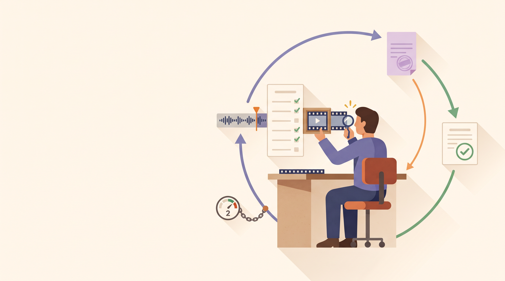

# The editor who checks the work: an AI cut that critiques and fixes itself — safely



The finale built you a whole studio: a brand brief goes in, a finished, on-brand ad comes out. But
every real studio has one more role you haven't hired yet — the person who watches the final cut
before it ships, catches the thing that's *almost* right, and sends it back for one fix.

This is that hire. It's a small, optional stage that turns the assembler from "make one cut and hope"
into **make a cut, measure it honestly, and if it's off, fix it and check again** — with a hard
guarantee that it never spins forever.

> The outcome you get: a final cut you can trust *because it was checked*, not because it was
> promised. And if something's wrong, the studio corrects itself before you ever see it — then stops,
> every time.

## The one idea: an agent that reviews its own work, on a leash

Everything up to now has flowed in one direction — plan, shoot, score, assemble, done. The QC room
adds the one shape that lets an agent **improve** its output: a **review loop**. Stage four stops
being a single assembler and becomes a two-person room that runs on repeat until the work is good:

1. **The assembler** builds the cut (exactly as before).
2. **A critic** looks at what just came out, *measures* it, and gives a verdict: *ship it*, or
   *here's what's wrong and how to fix it.*
3. If it's not ready, the assembler gets those notes and tries again. If it is, the room closes.

The important word is **safely**. A self-correcting loop is only trustworthy if it's guaranteed to
end — and this one is, two different ways. More on that below; it's the whole reason this can ship
turned *on*.

It's **optional and profile-agnostic**: the same QC room wraps the ad capstone *and* the storyboard
studio from the last post. Both ship with it enabled, so `adk web` now runs it by default. Flip one
switch (`enable_qc=False`) and you get the exact pre-QC behavior back, byte for byte.

## How it works

The whole feature is one construct wrapping stage four:

```python
# stage four, when a profile turns QC on:
LoopAgent(
    name="editor_qc",
    max_iterations=2,                    # the leash: at most two passes
    sub_agents=[assembler, critic],      # assembler FIRST, critic SECOND
)
```


**Assembler first, critic second — on purpose.** The loop runs its two members in order and starts
over from the top each pass. Putting the assembler first means the critic always has a *real,
just-built cut* in front of it — there's never a first-round reviewer staring at nothing.

### The critic measures — it doesn't have opinions

This is what makes the check trustworthy rather than decorative. The critic isn't asked "does this
*feel* right?" It's an agent whose only job is to **measure the file and judge from the numbers**. It
runs a tiny ruler over the output — the actual duration of the finished cut versus the video — and
checks three objective things:

- **It exists.** The final file must actually be on disk. A missing file fails — the critic never
  trusts a "here's your link" response, it confirms the bytes are there.
- **The sound fits the picture.** The finished cut must not run more than **one second** longer than
  the video. (This is the check with teeth — see the next section.)
- **It's within budget** — for the ad, the final cut must land inside the 15-second-to-2-minute
  envelope. The storyboard animatic is paced by its narration, so it skips this one.

The verdict comes back as **data, not prose** — a small filled-in form: *acceptable? yes/no; here are
the concrete problems; here's exactly how to fix them.* That "acceptable" answer is **required** — a
half-formed verdict can't slip through and get treated as a silent pass. *(Under the hood this is the
same `output_schema` habit from the planner: the critic's reply is validated against a Pydantic model,
`QCVerdict`, and filed in shared state.)*

### The defect it catches — a real one, on camera

Here's the honest part, and it's a nice piece of teaching. The problem the QC room catches is a *real*
one from earlier in the series: the music bed is a fixed ~30-second clip, and mixing it onto a
20-second ad leaves ten seconds of music playing over a frozen tail. In the finale, a small trim step
quietly prevented that. The QC room makes it **visible** instead.

When QC is on, the assembler's *first* pass deliberately skips that trim, so the music genuinely
overruns the picture. The critic measures it — *final 30.1s vs video 20.0s, that's 10.1 seconds too
long* — marks the cut **not acceptable**, and writes the fix: *re-trim the audio to the picture, then
re-combine.* On the second pass the assembler reads those notes, applies the trim, and the critic
re-measures — now in sync — and approves it.

Nothing here is faked. It's a real defect (a real skipped step), caught by a real measurement, fixed
by a real correction. That's the difference between a demo that *shows* self-correction and one that
actually *does* it. And it's gated behind the QC switch on purpose: with QC off, the assembler is the
same always-trims one from the finale. The trap only appears in the room built to teach it.

### Why it always stops — the part that makes this safe to ship

A loop that fixes its own work is exactly as trustworthy as its guarantee to terminate. This one has
two independent stops, and it can't miss both:

1. **It passes.** When the cut is good, the critic calls a one-line "we're done" tool that tells the
   loop to close. That's the normal exit.
2. **The leash.** Even if the critic *never* says yes, the loop is capped at **two passes** and stops
   anyway. This is a framework-level guarantee — one pass to build and catch, one to fix and confirm —
   so there is **no way to spin forever**, no runaway generation bill, no hang.

In the captured credentialed run it played out exactly as designed: pass one caught a real ~10-second
audio overrun, pass two trimmed it into sync (down to a 0.042-second difference), and the room closed
at the cap — never a wasted third pass. Whichever way it ends, **the artifact you get is the corrected
cut**, and you know it was measured, not merely produced.

## Try it

If you've run the finale, you already have this — it's on by default now:

```bash
adk web                   # pick "ad_creative_director_ad"
```

Brief it like before ("a 20-second ad for Aurora cold-brew…"). This time, watch the run: you'll see
the assembler produce a cut, the critic measure it and (on the deliberately-skipped-trim first pass)
send it back with notes, and the second cut come out in sync and approved. You get the same
`final_ad.mp4` you did before — but now it arrives *checked*, and you saw it check itself.

To feel the contrast, set `enable_qc=False` on the profile: stage four goes back to the single
always-trims assembler, and the room disappears. Same studio, one switch.

## Why this is the right note to end on

Every step in this series added exactly one new capability, and this is the last one: the ability for
the studio to **judge and improve its own output within safe limits**. It ties the whole arc together
because it's built entirely from habits you've already met — a structured verdict instead of prose
(the planner's `output_schema`), measuring by existence instead of trusting a link (verify-by-existence,
from the very first agent), and reusing a stage rather than rebuilding it (the assembler, unchanged
inside the loop). The only new idea is the leash: self-correction you can turn on without fear,
because it is guaranteed to end.

That's a studio you can put on a deadline — one that not only makes the work, but checks it.

## See also

- **The `story-generator` skill** — its self-critique **"QC room"** is the storytelling craft this
  stage re-expresses as a runnable ADK construct. Read it for the technique; this agent is the same
  idea wired into a real pipeline. (Complements the demos, never forks them.)
- **[The Creative Director's Assistant](run-01-ad-creative-director.md)** — the finale this stage sits
  on top of; the QC room is stage four of that same engine.
- **[The Creative Studio (dogfood)](run-02-creative-studio-dogfood.md)** — the storyboard profile that
  also gets the QC room, profile-agnostic, on its animatic.

## Next

That's the whole crawl→walk→run arc: from a single collaborator that takes one instruction, to a
studio that plans, produces, assembles, packages, and now **checks its own work** — all from a
plain-language brief, all verified to actually exist. Head back to the [series
overview](00-overview.md) to see the full path in one place.

---

<sub>Grounded on merged PR **#1824** (squash-merge `57b54733` on `main`; content verified against the
shipped tree at `ad-creative-director/`). Code is condensed for reading; the full wiring — the
`LoopAgent(sub_agents=[assembler, critic], max_iterations=2)`, the `QCVerdict` `output_schema`, the
`probe_media_durations`/`exit_loop` tools, the `{qc_verdict?}` re-run template, the `enable_qc`-gated
first-pass skipped trim, and the `QC_SYNC_TOLERANCE_SECONDS = 1.0` sync tolerance — is in
`ad_creative_director/agent.py`, `profiles.py`, and `schemas.py`. The `LoopAgent` stop semantics
(escalate via `event.actions.escalate`; the `max_iterations` hard cap) are source-verified against ADK
2.8.0 (`loop_agent.py:95-97/116-117/126-127`), and the `QCVerdict` contract is locked by
`tests/test_schemas.py` (4/4). The catch→correct→escalate behavior (a ~10s overrun caught on pass 1,
trimmed to 0.042s in sync on pass 2, escalate at the cap) is from the merged PR's captured credentialed
run. Diagram: `blog/diagrams/editor-qc-room.dot`. Visual identity: `blog/graphic-theme.md`.</sub>
