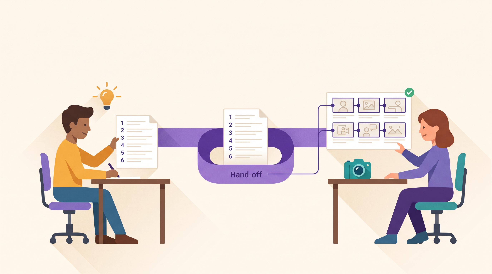
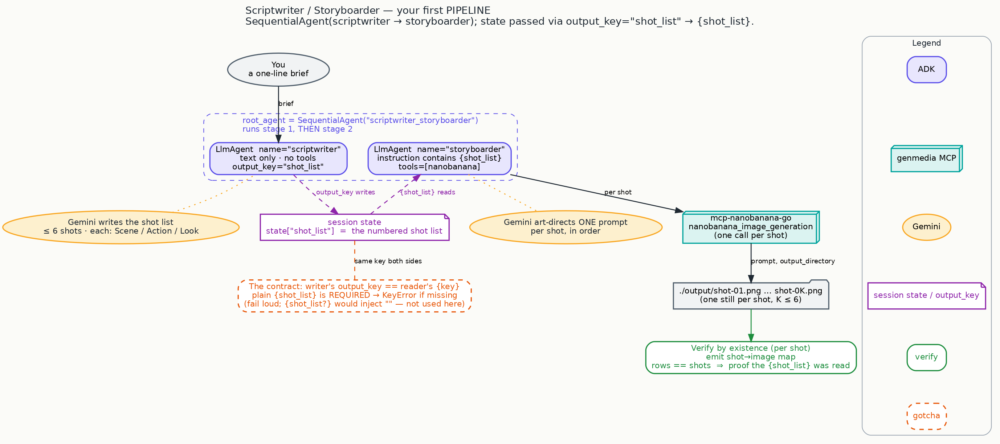

# The Scriptwriter & Storyboarder: one line becomes a scripted, illustrated storyboard — automatically



Every campaign starts the same way: a single line of intent — *"a lonely lighthouse keeper's last
night on the job"* — and the daunting gap between that idea and something you can actually pitch.
Bridging it usually means a writer breaking the concept into shots, then an artist illustrating each
one, then someone making sure the drawings actually match the script.

This collaborator does the whole handoff for you. Give it one line, and it comes back with a
**numbered shot list** *and* a **storyboard** — one illustrated frame per shot, in order, matched
one-to-one to the script. A pitch-ready pre-viz from a sentence.

> This is the moment your collaborators stop working solo and start working *as a team* — one hands
> its work cleanly to the next, with nothing lost in translation.

## What makes this one a leap

Until now, every collaborator in this series was a single specialist. This is the first **pipeline**:
two collaborators, working in order, passing the creative brief down the line like a real production.

- The **Scriptwriter** reads your one-liner and writes a tight, shootable shot list — up to six
  shots, each with its *Scene*, *Action*, and *Look*.
- The **Storyboarder** picks up that shot list and illustrates it — generating exactly one still per
  shot, then handing you a shot-by-shot map so you can see the script and the frames side by side.

The important part is invisible: the writer's shot list lands on the artist's desk **automatically**.
No copy-paste, no re-briefing. That clean handoff is what turns two agents into a studio.

*Powerful, made approachable:* the coordination that would normally need a producer is built in — you
just supply the idea.

## Look how little it takes to build a team

Two collaborators and a line that says "run them in order." That's the whole pipeline:

```python
scriptwriter = LlmAgent(
    name="scriptwriter",
    instruction=SCRIPTWRITER_INSTRUCTION,   # "turn the brief into a numbered shot list, up to 6"
    output_key="shot_list",                 # <- writes its result onto the shared desk
)

storyboarder = LlmAgent(
    name="storyboarder",
    instruction=STORYBOARDER_INSTRUCTION,   # contains {shot_list}  <- reads it back off the desk
    tools=[nanobanana],                     # the same image tool from the Photoshoot
)

root_agent = SequentialAgent(               # run the writer, THEN the artist
    name="scriptwriter_storyboarder",
    sub_agents=[scriptwriter, storyboarder],
)
```

*(Condensed from the shipped
[`scriptwriter_storyboarder/agent.py`](https://github.com/GoogleCloudPlatform/vertex-ai-creative-studio/blob/main/experiments/mcp-genmedia/sample-agents/adk-genmedia-series/scriptwriter-storyboarder/scriptwriter_storyboarder/agent.py).)*
Notice the Storyboarder reuses the exact same image tool you gave the Photoshoot in step 1 — you're
not learning new equipment here, you're learning how collaborators hand work to each other.



## The one new idea: the shared desk

Here's the whole trick, and it's beautifully simple. Think of a **shared desk** between the two
collaborators:

- The Scriptwriter is told to **leave its shot list on the desk** under a label — `shot_list`.
- The Storyboarder's brief literally says *"here is the shot list from the desk"* — it reads back
  whatever is filed under that same label.

Run them in order and the writer always fills the desk before the artist reaches for it. That's ADK's
native way to pass work between collaborators: one writes a labeled result, the next reads it by the
same label — no glue, no plumbing you have to maintain. *(Under the hood: the writer's `output_key`
saves its text into session state, and the reader's `{shot_list}` template pulls it back in before
the artist runs — `llm_agent.py:419/1045` and `instructions_utils.py`, if you like to look.)*

The one rule: **both collaborators must use the same label.** Spell it `shot_list` on one side and
something else on the other and the handoff quietly breaks. The shipped agent is deliberately strict
about this — if the desk is empty when the artist reaches for it, it stops loudly rather than drawing
from nothing. That's a feature: a broken handoff should never pass silently into your storyboard.

## Try it

```bash
cp .env.example .env      # copy the template, fill in your settings
uv sync
source .venv/bin/activate
adk web                   # pick "scriptwriter_storyboarder"
```

Brief it with a single line:

> A lonely lighthouse keeper's last night on the job. Save the stills locally.

The Scriptwriter writes a numbered shot list (up to six shots); the Storyboarder illustrates each one
into your `./output/` folder and hands back a map like this:

```
Shot 1 -> ./output/shot-01.png (verified)
Shot 2 -> ./output/shot-02.png (verified)
…
```

Want it wide for a pitch deck, in the cloud? Just say so:

> Same brief, but 16:9 and save the stills to my cloud bucket.

*(The shipped agent was proven on a real credentialed run — a six-shot brief produced six real
stills, `shot-01.png` through `shot-06.png`, each matched to its shot.)*

## Why the storyboard you get back is trustworthy

Two guarantees, both built in:

**Every frame matches a shot — exactly.** The Storyboarder generates *one* still per numbered shot,
no more, no fewer, and ends with a map that has exactly as many rows as there are shots. That
one-to-one correspondence is your at-a-glance proof that the artist actually read the writer's
script — not a generic set of pretty pictures.

**Every frame is a real file you can open.** This is the same trust habit from the Photoshoot, now
applied per shot: the Storyboarder reports the concrete saved path (or cloud URL) for each still and
never claims a frame it can't point to. If a shot didn't save, it says so for that shot rather than
inventing a file.

## See also

- **The `story-generator` skill** — the same "writers' room → illustrate every scene" shape as a
  reusable creative recipe. This Scriptwriter / Storyboarder is that idea you can run as a live ADK
  pipeline; read the skill for deeper storytelling craft. (Complements the skills, never forks them.)

## Next

You've gone from single collaborators to a two-person team that hands work down the line. The finale
brings the whole crew together: **the creative director's assistant** — a brief fans out to the
Photoshoot, the Director, and the Music Producer working *in parallel*, then assembles their output
into one coordinated set of campaign assets. *(Publishing once it ships and its credentialed run
passes.)*

---

<sub>Grounded on merged PR **#1816** (merge commit 05e005a on `main`; content verified against the
shipped tree). Code condensed from `scriptwriter_storyboarder/agent.py` for reading; the full wiring
(the nanobanana stdio setup, both full instructions, the state-passing internals) is in the file.
State-passing behavior and the required-vs-optional `{shot_list}` template are source-verified against
ADK 2.8.0 and the merged agent's README, and confirmed by the agent's credentialed run. Diagram:
`blog/diagrams/scriptwriter-storyboarder.dot`. Visual identity: `blog/graphic-theme.md`.</sub>
